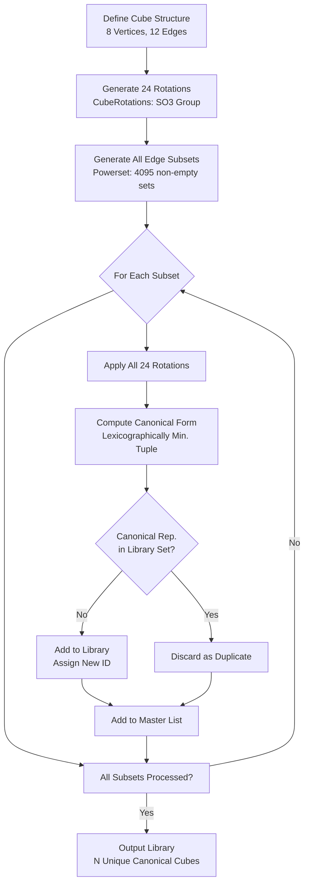

# Voxelian
A Sol Lewitt's Open Cube encoder model


  

##
> Screenshot shows the equivalent of 'Hello, World!'  

Using Sol Lewitt's open cube model for data encoding using 217 unique cubes, not the theoretical estimate 144.  
This encoder utilizes base64 to condense the character table as an intermediate layer and have a flexible input range,  
this does result in only 29.5% coverage(*) space.  

# Encoding Density & Coverage

  

The encoder's base principle is what determines the coverage length within the cube space available.  
You could technically introduce an encryption layer as well providing you with extra security.  

```
 Base 16 (Hexadecimal)     : 7.4% coverage
 Base 64 (default)         : 29.5% coverage
 Base 128 (ASCII)          : 59% coverage
```

## Logic In-Depth


# Usage
```
python encoder.py -h
usage: encoder.py [-h] [--string TEXT] [--vis] [--test]

Voxelian console encoder

options:
  -h, --help     show this help message and exit
  --string TEXT  Message phrase
  --vis          Render visualized presentation
  --test         Perform unit test
```

## Encoding a string
```
python encoder.py --vis --string 'Hello, World!'
Result success
Serialized size: 53 bytes
Format info: {'format': 'Cube1', 'version': 1, 'cube_count': 20, 'size_bytes': 53, 'has_metadata': False}
```

Encoder saves 'output.vox' in local root folder, a serialized state of the 'encoded_ids' data for reversing the process.

