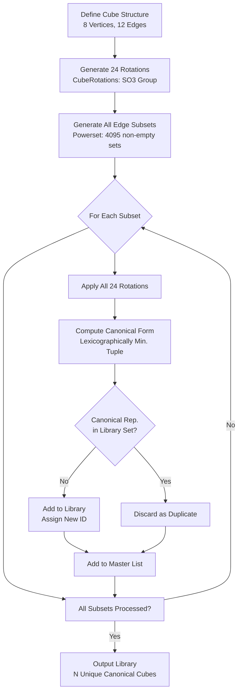

# Voxelian (WIP)
A Sol Lewitt's Open Cube encoder model  
This is a work in progress, the code might change in the future.  
Inpsired by https://youtu.be/_BrFKp-U8GI


##
> Screenshot shows the equivalent of 'Hello, World!'  

```
python encoder.py --string "Hello, World!" --checksum --vis
==================================================
Running encoder...
==================================================
Result           : success
Original size    : 13 bytes
Encoded cubes    : 20
Unique IDs       : 16
Checksum         : 118
Encoding         : [18, 6, 21, 44, 27, 6, 60, 44, 8, 5, 29, 47, 28, 38, 49, 36, 8, 16, 64, 64]
```

Using Sol Lewitt's open cube model for data encoding using 217 unique cubes, not the theoretical estimate 144.  
This encoder utilizes base64 to condense the character table as an intermediate layer and have a flexible input range,  
this does result in only 29.5% coverage(*) space.  

# Encoding Density & Coverage

   
  
(the first few blocks appear to have no edges, that's because the edges (red) are same size as the 'box' they got drawn into.)

The encoder's base principle is what determines the coverage length within the cube space available.  
You could technically introduce an encryption layer as well providing you with extra security.  

##
```
 Base 16 (Hexadecimal)     : 7.4% coverage
 Base 64 (default)         : 29.5% coverage
 Base 128 (ASCII)          : 59% coverage
```

## Logic In-Depth



# Usage
```
usage: encoder.py [-h] [--encode TEXT | --file PATH | --test] [--padding N] [--checksum] [--visualize] [--output FILE] [--encoding ENCODING]

Voxelian Encoder

options:
  -h, --help            show this help message and exit
  --encode TEXT, --string TEXT
                        Text message to encode
  --file PATH           Input file to encode
  --test                Run comprehensive unit tests
  --padding N           Add N random padding characters
  --checksum            Compute and validate checksum
  --visualize, --vis    Generate 3D visualization
  --output FILE, -o FILE
                        Output file (default: output.vox)
  --encoding ENCODING   Text encoding (default: utf-8)

Examples:
                      encoder.py --encode "Hello World"
                      encoder.py --encode "Message" --checksum --visualize
                      encoder.py --test
                      encoder.py --encode "01234" --padding 32

```

*encoder saves all output in local root folder*

# Unit testing
```
python encoder.py --test
==================================================
Running encoder...
Running tests...
==================================================
test_base64_symbol_coverage (__main__.VoxelianTestSuite)
Test Base64 symbol to cube mapping. ... ok
test_basic_encoding_decoding (__main__.VoxelianTestSuite)
Test basic string encoding/decoding. ... ok
test_binary_round_trip (__main__.VoxelianTestSuite)
Test binary data encoding/decoding round-trip. ... ok
test_canonical_library_generation (__main__.VoxelianTestSuite)
Test canonical cube library. ... ok
test_checksum_edge_cases (__main__.VoxelianTestSuite)
Test checksum with edge cases. ... ok
test_checksum_functionality (__main__.VoxelianTestSuite)
Test checksum computation and validation. ... ok
test_cube_operations (__main__.VoxelianTestSuite)
Test cube-specific operations. ... ok
test_edge_cases (__main__.VoxelianTestSuite)
Test edge cases for encoding/decoding. ... ok
test_error_handling (__main__.VoxelianTestSuite)
Test error handling for invalid inputs. ... ok
test_library_consistency (__main__.VoxelianTestSuite)
Test library consistency. ... ok
test_performance (__main__.VoxelianTestSuite)
Test encoding/decoding performance with large data. ... ok
test_rotation_generation (__main__.VoxelianTestSuite)
Test cube rotation generation. ... ok

----------------------------------------------------------------------
Ran 12 tests in 4.417s

OK
```
